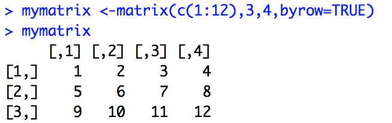
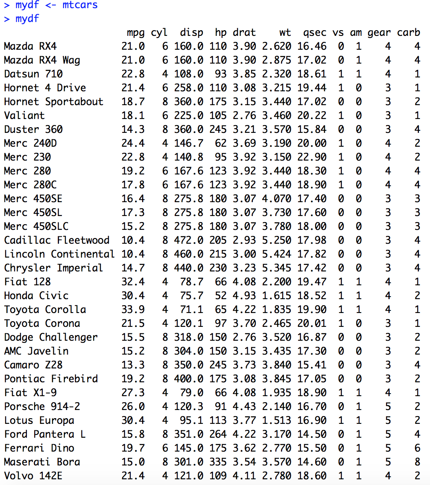
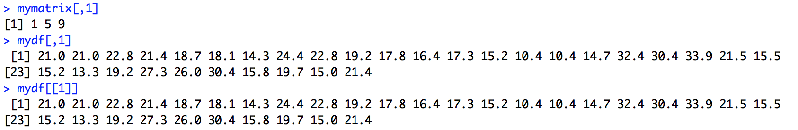
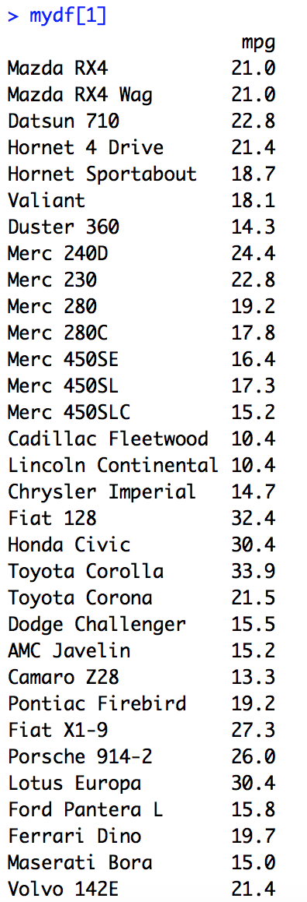
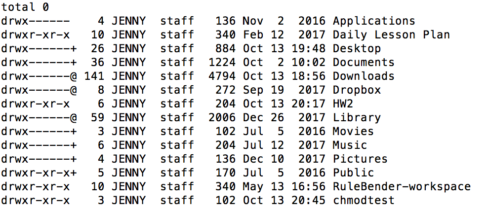
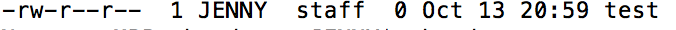
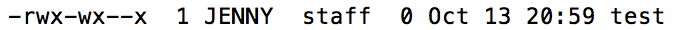

# Homework2

#### Please design questions suitable for an upper level undergraduate course to illustrate the concepts we covered in class. Then, provide the answer key for your own questions (i.e. answer your own questions). Below, a prompt is given for the concept you are to design a question from. When given an option, try your best to choose the one that you're least familiar with so you can hone your own understanding.

1. Ask a question that requires a student to understand naigation and manipulation of dirctories in a filesystem. Your question should require an anser using at least the following commands/ concepts: cd, ../, mkdir, rmdir 
  * **Question:** Create a directory called "emotion" on to your home directory and inside the "emotion" directory create two directories called "happy" and "sad". Again inside the "happy" directory create "my pet". Then remove "sad" directory. After doing this, check out whether this actually worked. 

  * **Answer:**
  > $ mkdir ~/emotion  
    $ cd emotion  
    $ mkdir happy  
    $ mkdir sad  
    $ cd happy  
    $ mkdir mypet  
    $ cd ../  
    $ rmdir sad  
    $ ls emotion  

"$ ls emotion" will help you to check whether this procedure worked. This shows the directory called happy only because I remove "sad" directory from "emotion" 

### Question 1 Comments:
Very nicely done. I would just make sure you do ls ../emotion as ls emotion would do nothing since you are already inside the emotion directory. ls ./ would also work. Also please do not use $ before commands as it makes it difficult to copy and paste them into my console for testing. I recommend doing the triple single quote notation for showing code, but the current way you are doing it works great too. good job!

2. Ask a question that requires a student to understand the difference between accessing a column in a matrix with numeric indices versus accessing a column in a data frame with numeric indices. Your question should require an answer comparing the following: mymatrix[,1] vs. mydf[,1] vs. mydf[1] vs. mydf[[1]].
  * **Question:** Create 3 by 4 matrix with entries of 1 through 12 by row and give the matrix name it as mymatrix. Then create or import or use the built in data frame and name it as mydf. Compare mymatrix[,1] vs. mydf[,1] vs. mydf[1] vs. mydf[[1]].
  * **Answer:**
  
  
  
  
  
 
mymatrix[,1] shows the first column of the mymatrix which is 1 5 9. Same as mymatrix[,1], mydf[,1] and mydf[[1]] shows the first column of the mydf. mydf[,1] and mydf[[1]] are equivalent. mydf[1] shows the all the information with first column. Each car's name and mpg. 
 
### Question 2 Comments:

Good job. It's worth nothing that matrix columns can **only** be accessed with the ```[,number]``` method.
 
3. Ask a question that requires a student to understand how to share access to a directory and a file in that directory on a Unix/Linux filesystem from their home directory with a colleague without exposing the user's entire directory. Your question should require an answer using chmod {u,g,o}{+,-}{r,w,x} (not using octal permissions).
  * **Question:** Create a directory called "chmodtest" on your home directory and create a file called "test" inside chmodtest directory. Allow you to read, write and execute a file, and allow group to write and execute a file only, and allow others to execute a file only
  * **Answer:**
  > $ cd ~/  
    $ mkdir chmodtest  
    $ ls -l   

    

ls -l is to check whether the directory is executable or not. When we check the chmodtest directory, it is already executable.(Because this will be the parent directory we have to make sure this directory is executable) If it is not executable, we have to change it but since it is executable for default directory we don't need to change anything. 
  > $ cd chmodtest  
    $ touch test  
    $ ls -l  

     

ls -l is to check the property of the file. Who is allow to read, write and execute. After chekcing this property, we know which one to edit.   
  > $ chmod u+x test  
    $ chmod g-r test  
    $ chmod g+wx test  
    $ chmod o-r test  
    $ chmod o+x test  
    $ ls -l  
 
  
